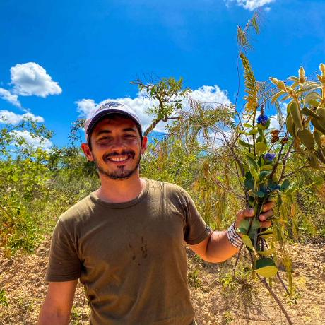
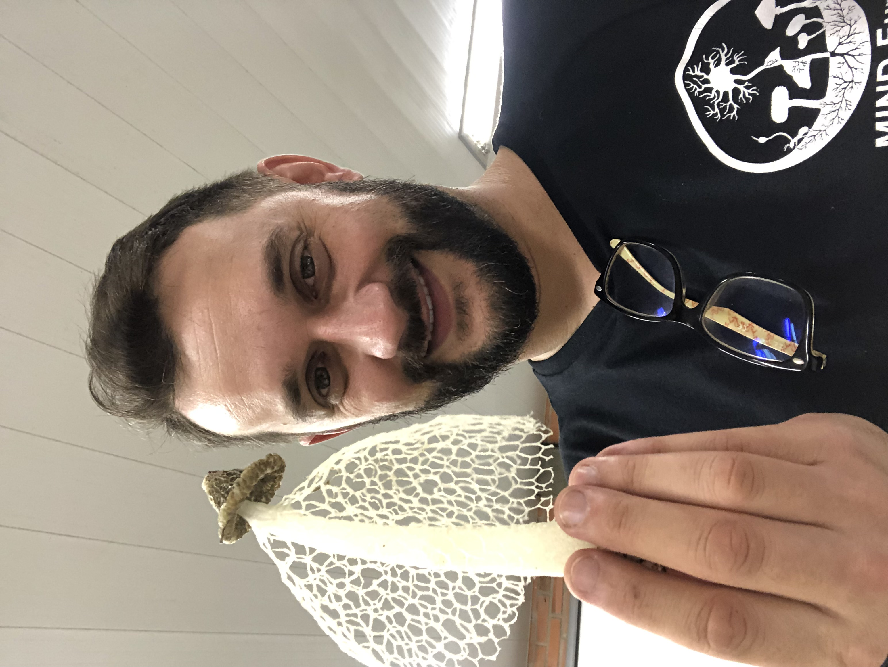
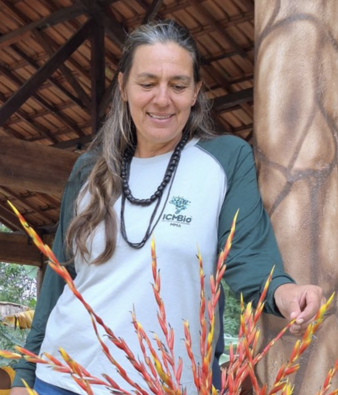

---
format:
  html:
    toc: true
    toc-depth: 3
resources:
  - authors/images/
---

<style>
  body {
    background-repeat: repeat-y;
    background-size: cover;
    background-attachment: fixed;
    background-position: top center;
    position: relative;
    z-index: 0;
  }

  .background-overlay {
    position: fixed;
    top: 0;
    left: 0;
    width: 100%;
    height: 100%;
    background-color: rgba(255, 255, 255, 0.85);
    z-index: -1;
  }

  .icon-link {
    display: inline-block;
    margin: 0 6px;
  }

  .icon-link img {
    width: 18px;
    height: 18px;
    vertical-align: text-bottom;
  }
</style>

## The `fungaR` Developer

```{=html}
<div class="authors-group">

  <div class="author-card">
    
    <div class="author-info">
      <h3 class="author-name">Domingos Cardoso</h3>
      <p>
        <a class="icon-link" href="mailto:domingoscardoso@jbrj.gov.br"></a>
        <a class="icon-link" href="https://orcid.org/0000-0001-7072-2656" target="_blank"></a>
        <a class="icon-link" href="http://lattes.cnpq.br/2228981567893077" target="_blank"></a>
      </p>
      <p>Taxonomist and bioinformatician authoring and maintaining the fungaR package, responsible for designing and coding functions as well as developing the project website</p>
    </div>
  </div>

</div>
```

## The Funga Coordination Team

```{=html}
<div class="authors-group">

  <div class="author-card">
    
    <div class="author-info">
      <h3 class="author-name">E.Ricardo Drechsler-Santos</h3>
      <p>
        <a class="icon-link" href="mailto:drechslersantos@yahoo.com.br "></a>
        <a class="icon-link" href="https://orcid.org/0000-0002-3702-8715" target="_blank"></a>
        <a class="icon-link" href="http://lattes.cnpq.br/7181472061444803" target="_blank"></a>
      </p>
      <p>Expert fungi taxonomy, phylogenetics, and conservation</p>
    </div>
  </div>

  <div class="author-card">
    
    <div class="author-info">
      <h3 class="author-name">Diogo Henrique Costa de Rezende</h3>
      <p>
        <a class="icon-link" href="mailto:domingoscardoso@jbrj.gov.br"></a>
        <a class="icon-link" href="https://orcid.org/0000-0002-7381-6954" target="_blank"></a>
        <a class="icon-link" href="http://lattes.cnpq.br/4989168413703096" target="_blank"></a>
      </p>
      <p>Expert fungi taxonomy and phylogenetics</p>
    </div>
  </div>

</div>
```

## The Flora e Funga do Brasil Coordination Team

```{=html}
<div class="authors-group">

  <div class="author-card">
    
    <div class="author-info">
      <h3 class="author-name">Rafaela Forzza</h3>
      <p>
        <a class="icon-link" href="mailto:rafaela@jbrj.gov.br"></a>
        <a class="icon-link" href="https://orcid.org/0000-0002-7035-9313" target="_blank"></a>
        <a class="icon-link" href="http://lattes.cnpq.br/6249814039461102" target="_blank"></a>
      </p>
      <p>Expert in biodiversity data integration and coordinator of the Flora e Funga do Brasil initiative</p>
    </div>
  </div>

  <div class="author-card">
    
    <div class="author-info">
      <h3 class="author-name">Domingos Cardoso</h3>
      <p>
        <a class="icon-link" href="mailto:domingoscardoso@jbrj.gov.br"></a>
        <a class="icon-link" href="https://orcid.org/0000-0001-7072-2656" target="_blank"></a>
        <a class="icon-link" href="http://lattes.cnpq.br/2228981567893077" target="_blank"></a>
      </p>
      <p>Expert in biodiversity data integration and coordinator of the Flora e Funga do Brasil initiative</p>
    </div>
  </div>
  
  <div class="author-card">
    
    <div class="author-info">
      <h3 class="author-name">Fabiana Filardi</h3>
      <p>
        <a class="icon-link" href="mailto:ffilardi@jbrj.gov.br"></a>
        <a class="icon-link" href="https://orcid.org/0000-0002-0372-4325" target="_blank"></a>
        <a class="icon-link" href="http://lattes.cnpq.br/5902829568480499" target="_blank"></a>
      </p>
      <p>Expert in biodiversity data integration and coordinator of the Flora e Funga do Brasil initiative</p>
    </div>
  </div>

</div>
```

<style>
.authors-group {
  display: flex;
  flex-wrap: wrap;
  justify-content: center;
  gap: 24px;
  margin-bottom: 2rem;
}

.author-card {
  background: #f8f9fa;
  border-radius: 12px;
  box-shadow: 0 0 10px rgba(0,0,0,0.1);
  padding: 1rem;
  width: 300px;
  transition: transform 0.3s ease;
}

.author-card:hover {
  transform: scale(1.05);
  z-index: 2;
}

.author-photo {
  width: 100%;
  height: 260px;
  object-fit: cover;
  border-radius: 10px;
  margin-bottom: 1rem;
}

.author-info {
  text-align: center;
}

.author-info p a {
  margin: 0 6px;
  color: #007bff;
  font-size: 1.1rem;
}

.author-name {
  margin-top: 0;
  margin-bottom: 0.5rem;
  text-align: center;
}
</style>
